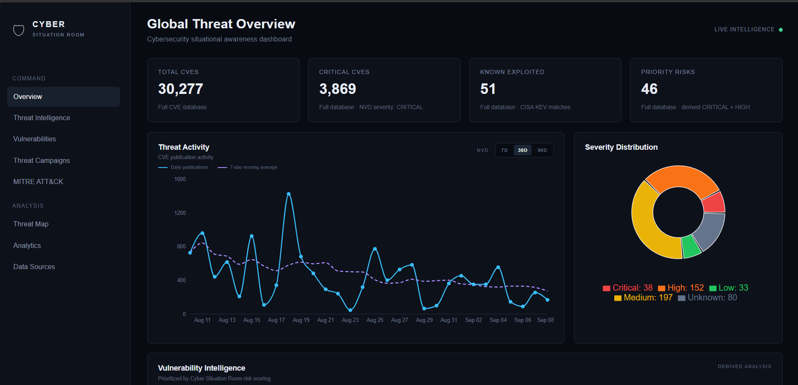

# Cyber Situation Room

A cybersecurity threat intelligence and vulnerability analysis platform designed to support SOC and CTI analyst workflows.

## Dashboard

## Overview

Cyber Situation Room combines threat intelligence, vulnerability intelligence, CISA advisories, NVD CVEs, CISA KEV data, correlation analysis, risk scoring, and MITRE ATT&CK evidence into an analyst-focused dashboard.

## Core Capabilities

- Threat Intelligence feed and filtering
- CISA advisory intelligence
- NVD vulnerability intelligence
- CISA KEV enrichment
- CVE correlation and relationship analysis
- Vulnerability prioritization
- CVSS and risk analysis
- Vulnerability timelines
- MITRE ATT&CK technique mapping
- Evidence-driven analyst workflow
- Security data visualization

## Analyst Workflow

Threat Intelligence -> CISA Advisory -> CVE Correlation -> NVD + CISA KEV -> Risk Analysis -> MITRE ATT&CK Evidence -> Analyst Investigation

## Technology Stack

### Frontend
- React
- TypeScript
- Vite
- Recharts
- TanStack React Query

### Backend
- Python
- FastAPI
- SQLAlchemy
- Uvicorn
- SQLite

### Intelligence Sources
- NVD
- CISA Known Exploited Vulnerabilities Catalog
- CISA threat and advisory intelligence
- MITRE ATT&CK

## API Endpoints

GET /cves
GET /vulnerabilities/prioritized?limit=10
GET /correlations/graph?limit=12
GET /threat-intelligence?limit=30
GET /threat-intelligence/summary
GET /intelligence-analysis
GET /mitre-attack/analysis

## Project Structure

cyber-situation-room/
  backend/
    main.py
    database.py
    models.py
    ingest_cves.py
    ingest_cisa.py
    ingest_attack.py
    enrich_kev.py
    cleanup_old_cves.py
    requirements.txt
  frontend/
    src/
      App.tsx
      App.css
      index.css
      main.tsx
      apiCache.ts
  README.md
  .gitignore

## Running the Backend

cd "C:\Users\Acer\Documents\cyber-situation-room\backend"
.\.venv\Scripts\python.exe -m uvicorn main:app --host 127.0.0.1 --port 8000

## Running the Frontend

cd "C:\Users\Acer\Documents\cyber-situation-room\frontend"
npm.cmd run dev

## Production Build

npm.cmd run build

## Validation

The application has been functionally tested across the frontend build, backend API, vulnerability prioritization, correlation intelligence, threat intelligence, intelligence analysis, MITRE ATT&CK analysis, sidebar navigation, CISA advisory workflow, CVE correlation, risk analysis, and MITRE evidence workflow.

## Security Focus

Cyber Threat Intelligence | Security Operations | Vulnerability Management | Threat Correlation | Security Analytics | MITRE ATT&CK

## Project Status

Functionally verified and prepared as a cybersecurity portfolio project.
